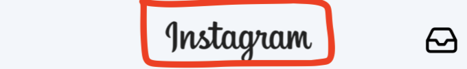

# Week 2 - **Instagram feed 🌄**

## Introduction 🌟

Let's build a news 📰 app 📱 using [React Native](https://facebook.github.io/react-native/) & [Expo](https://expo.io/). Our app will help users find information about current world 🌎 events. We'll do so by requesting data from a 3rd party API and then consuming this data in our application.

### What is the final result


### Features 🏆

- [ ] Create header with Instagram logo and `inbox` button
- [ ] Add post owner avatar image and name
- [ ] Create like button
- [ ] Create comment button
- [ ] Create share button
- [ ] Create likes count
- [ ] Alert when press on any button

### Learning Objectives ✍️📚📝 ️

1. Learn how to layout with Flexbox [Read](https://facebook.github.io/react-native/docs/flexbox)

### **Milestone 1 🛣🏃 Init project**

**A)** Use `expo init` to create your project. I'm calling mine `instagram-feed`.

### **Milestone 2 🛣🏃 Instagram header**

Add the Instagram header, try to figure out how to layout this


- Add the `Image` logo Instagram : [How to use Image](https://facebook.github.io/react-native/docs/image)
- With a lot of `resizeMode`, `resizeMode` is use to determines how to resize the image when the frame doesn't match the raw image dimensions. [ResizeMode](https://facebook.github.io/react-native/docs/image#resizemode)

```
<Image
  source={{
    uri:
      'https://upload.wikimedia.org/wikipedia/commons/thumb/2/2a/Instagram_logo.svg/1200px-Instagram_logo.svg.png'
  }}
  style={{
    flex: 1,
    width: null,
    height: 40
  }}
  resizeMode="contain"
/>
```

- This layout just simple 1 row and 2 items in there. Try to use

```
<View
  style={{
    flexDirection: 'row',
    backgroundColor: '#f3f6fa',
    alignItems: 'center',
    justifyContent: 'space-between',
  }}
>
  <Image
    source={{
      uri:
        'https://upload.wikimedia.org/wikipedia/commons/thumb/2/2a/Instagram_logo.svg/1200px-Instagram_logo.svg.png'
    }}
    style={{
      flex: 1,
      width: null,
      height: 44
    }}
    resizeMode="contain"
  />
  <Feather name="inbox" size={27} color="black" />
</View>
```

- But you will see it a little bit to the left side. Try to add 1 more `Tricky empty view` to make it center

```
<View
  style={{
    flexDirection: 'row',
    backgroundColor: '#f3f6fa',
    alignItems: 'center',
    justifyContent: 'space-between',
  }}
>
  <View style={{ width: 27 }} />
  <Image
    source={{
      uri:
        'https://upload.wikimedia.org/wikipedia/commons/thumb/2/2a/Instagram_logo.svg/1200px-Instagram_logo.svg.png'
    }}
    style={{
      flex: 1,
      width: null,
      height: 44
    }}
    resizeMode="contain"
  />
  <Feather name="inbox" size={27} color="black" />
</View>
```

### **Milestone 3: 🌄 1 Post image**

Download some big wallpapers image and put in the `assets` folder.

| `assets` folder : Is the place you put all of images of application

Then try to display the simple image you just downloaded

```
<View
  style={{
    height: 300 // Height of image
  }}
>
  <Image
    source={require('../assets/image.png)}
    style={{
      flex: 1,
      width: null,
      height: null
    }}
    resizeMode="cover"
  />
</View>
```

### **Milestone 4 🌄 Multiple post image ?**

A/ Download multiple big wallpapers image and put in the `assets` folder.

Then create a fake array of feeds. With some data

- id : Unique feed id
- name : Name of of that post
- image : Link of image
- avatar : Avatar of poster
- likeCount : Number of likes of image

```
const feedData = [
  {
    id: 1,
    name: 'CoderSchool',
    image: require('./assets/1.jpeg'),
    likeCount: 128,
    avatar: require('./assets/avatar.jpeg')
  },
  {
    id: 2,
    name: 'Whoami',
    image: require('./assets/2.jpeg'),
    likeCount: 20,
    avatar: require('./assets/avatar.jpeg')
  },
  {
    id: 3,
    name: 'Wellcome Home',
    image: require('./assets/3.jpeg'),
    likeCount: 520,
    avatar: require('./assets/avatar.jpeg')
  },
];
```

Try to loop through the array data using `map`

```
{feedData.map(feed => {
  return (
    ...
  )
}
```

B/ Add poster avatar and name. This time try to put the style in `StyleSheet.create` to make your code look clean

```
render() {
  return (
    <View style={styles.nameWrapper}>
      <Image
        source={feed.avatar}
        style={styles.imageAvatar}
        resizeMode="cover"
      />
      <Text style={styles.posterName} >
        {feed.name}
      </Text>
    </View>
  )
}

const styles = StyleSheet.create({
  nameWrapper: {
    flex: 1,
    flexDirection: 'row',
    alignItems: 'center',
    marginVertical: 7,
    marginHorizontal: 12
  },
  imageAvatar: {
    width: 46,
    height: 46,
    borderRadius: 23
  },
  posterName: {
      marginLeft: 12,
      fontSize: 15,
      fontWeight: '500'
    }
})
```

### **Milestone 5 🛣🏃 Like, Comment, Share**

A/ Now we need to create 3 button Like, Comment, and Share button. Go find your needed icon at here : [Set Icon](https://expo.github.io/vector-icons/)

```
<View
  style={{
    flex: 1,
    flexDirection: 'row',
  }}
>
  <Feather
    name="heart"
    size={27}
    color="black"
  />
  <Feather
    name="message-square"
    size={27}
    color="black"
  />
  <Feather
    name="share"
    size={27}
    color="black"
  />
</View>
```

### **Milestone 6 🛣🏃PRESS IT**

Now we need to add `onPress` action to each icon . Example with the first one : Like.
Here is the documentation about Alert : [Alert](https://facebook.github.io/react-native/docs/alert)

```
<Feather
  name="heart"
  size={27}
  color="black"
  onPress={() => alert("Liked")}
/>
```

Make sure you try this and the `alert` display.
Try to try it yourself with something like prompt `yes`, `no` actions

[Alert](https://facebook.github.io/react-native/docs/alert)

```
Alert.alert(
  'Alert Title',
  'Are you sure like this image',
  [
    {text: 'Yes', onPress: () => console.log('Yes. I like this image')},
    {
      text: 'No',
      onPress: () => console.log('I am not sure'),
      style: 'cancel',
    },
  ],
  {cancelable: false},
);
```

### **Milestone 7 🛣🏃How many likes you have ???**

Display the total likes count of your image.

```
<View
  style={{
    borderTopColor: '#d6d6d6',
    borderTopWidth: 1,
    borderBottomColor: '#d6d6d6',
    borderBottomWidth: 1,
    flexDirection: 'row',
    alignItems: 'center',
  }}
>
  <Entypo name="heart" size={27} color="black" />
  <Text>
    {feed.likeCount} likes
  </Text>
</View>
```

